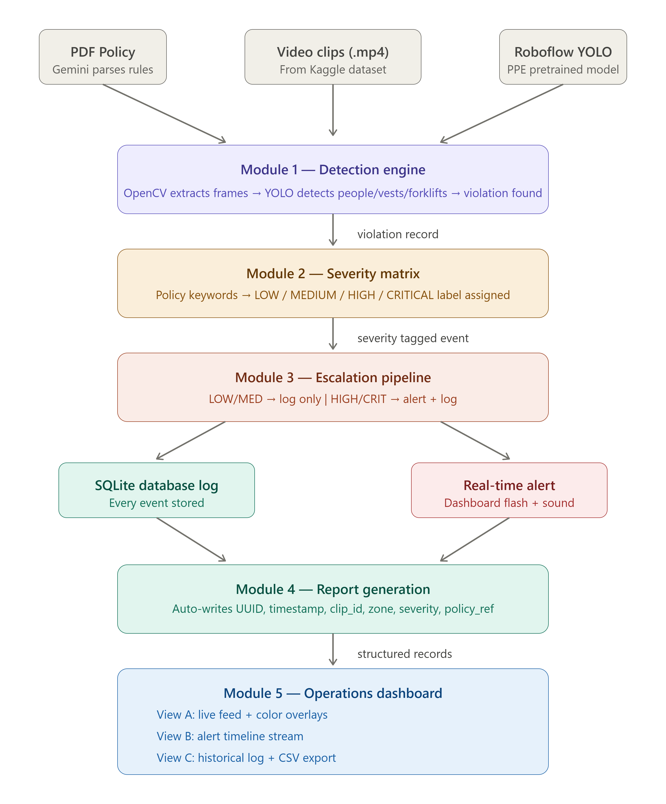

# 🏭 Factory Compliance & Alert Escalation System

An end-to-end automated compliance system that ingests raw factory video, parses a regulatory policy document, detects behavioral violations using a fine-tuned ResNet-50 model, classifies them by severity, routes alerts through an escalation pipeline, and presents everything through a live Streamlit operations dashboard.



---

## Table of Contents

- [Quick Start](#quick-start)
- [Architecture Overview](#architecture-overview)
- [Module Descriptions](#module-descriptions)
- [Policy Parsing Approach](#policy-parsing-approach)
- [Severity Mapping Rationale](#severity-mapping-rationale)
- [Model Selection & Training](#model-selection--training)
- [Dashboard](#dashboard)
- [Repository Structure](#repository-structure)
- [Known Limitations](#known-limitations)

---

## Quick Start

### Prerequisites

- Python 3.9+
- A Google Gemini API key (for policy parsing)
- The provided compliance policy PDF and video dataset

### Setup

```bash
# 1. Clone the repository
git clone <repo-url>
cd factory-compliance-system

# 2. Create virtual environment
python -m venv venv
venv\Scripts\activate        # Windows
# source venv/bin/activate   # Linux/Mac

# 3. Install dependencies
pip install -r requirements.txt

# 4. Set up environment variables
# Create a .env file in the project root:
echo GEMINI_API_KEY="your-api-key-here" > .env

# 5. Run the pipeline (processes 8 sample clips from data_run/)
python run.py

# 6. Launch the dashboard
streamlit run src/dashboard.py
```

### CLI Options

```bash
# Default — parse policy + process data_run/ clips
python run.py

# Specify a custom policy document
python run.py --policy compliance_policy.pdf

# Specify a custom data folder
python run.py --data data_run/

# Skip policy parsing (reuse existing outputs/policy_rules.json)
python run.py --skip-policy

# Full example with all flags
python run.py --policy compliance_policy.pdf --data data_run/ --skip-policy
```

---

## Architecture Overview

The system is implemented as a **5-module sequential pipeline**. Each module has well-defined inputs and outputs, and the output of each feeds into the next:

```
┌─────────────────────┐
│  compliance_policy  │──┐
│       .pdf          │  │
└─────────────────────┘  │
                         ▼
                ┌─────────────────┐     ┌──────────────────────┐
                │  parse_policy   │────▶│ outputs/             │
                │  (Gemini LLM)   │     │  policy_rules.json   │
                └─────────────────┘     └──────────┬───────────┘
                                                   │
          ┌────────────────────────────────────────┼─────────┐
          │                                        │         │
          ▼                                        ▼         │
┌─────────────────┐   ┌──────────────┐   ┌────────────────┐  │
│  data_run/      │──▶│  Module 1    │──▶│  Module 2      │  │
│  (video clips)  │   │  Detection   │   │  Severity      │  │
│                 │   │  Engine      │   │  Matrix        │  │
└─────────────────┘   │ (ResNet-50)  │   │                │  │
                      └──────────────┘   └───────┬────────┘  │
                                                 │           │
                                    ┌────────────┼───────┐   │
                                    ▼            ▼       │   │
                             ┌────────────┐ ┌─────────┐  │   │
                             │  Module 3  │ │Module 4  │  │   │
                             │ Escalation │ │ Reports  │  │   │
                             │  Pipeline  │ │ (SQLite) │  │   │
                             └──────┬─────┘ └────┬────┘  │   │
                                    │            │       │   │
                                    ▼            ▼       │   │
                             ┌──────────────────────────┐│   │
                             │      Module 5            ││   │
                             │  Operations Dashboard    │◀───┘
                             │     (Streamlit)          │
                             └──────────────────────────┘
```

### Data Flow

1. **Policy PDF** → Gemini LLM extracts structured rules → `policy_rules.json`
2. **Video clips** → ResNet-50 classifies frames → raw violation records
3. **Raw violations** + **policy rules** → severity tier assignment
4. **Enriched violations** → escalation routing (alert or log) + SQLite storage
5. **Dashboard** reads from SQLite → displays live feed, alerts, and historical logs

---

## Module Descriptions

### Module 1 — Detection Engine (`src/detection.py`)

**Role:** Ingest video clips and identify behavioral compliance violations.

**Approach:**
- A **ResNet-50** model fine-tuned on the provided video dataset classifies each clip into one of 8 behavior classes (4 safe + 4 unsafe).
- For each video, **10 evenly-spaced frames** are extracted using OpenCV.
- Each frame is classified independently, and a **majority vote** determines the clip's final classification.
- Only clips classified as one of the 4 **unsafe** behaviors (with confidence above 60%) are reported as violations.

**Output per violation:**
| Field | Description |
|---|---|
| `clip_id` | Source video filename |
| `timestamp` | Temporal position within the clip |
| `behavior_class` | Unsafe behavior detected (policy-derived) |
| `policy_section` | Policy section reference (e.g., Section 3.3.2) |
| `description` | Human-readable description of what was observed |
| `zone` | Inferred facility zone (e.g., Walkway Zone, Forklift Zone) |
| `confidence` | Average model confidence score |
| `vote_ratio` | Fraction of frames agreeing on the classification |

### Module 2 — Severity Categorization Matrix (`src/severity.py`)

**Role:** Assign a risk severity tier to each violation based on the compliance policy.

The severity assignment is **dynamically driven** by `policy_rules.json` — the callout levels extracted from the policy document are mapped to internal severity tiers:

| Policy Callout Level | Mapped Severity | Behavior Classes |
|---|---|---|
| `CRITICAL SAFETY NOTICE` | **CRITICAL** | Unauthorized Intervention, Carrying Overload with Forklift |
| `WARNING` | **HIGH** | Safe Walkway Violation (with personnel proximity) |
| `WARNING` (state-based) | **LOW** | Opened Panel Cover (equipment condition, no immediate personnel exposure) |

Context-based escalation allows `LOW` → `MEDIUM` when additional factors are detected (e.g., personnel proximity to an opened panel).

### Module 3 — Escalation Pipeline (`src/escalation.py`)

**Role:** Route violations to the correct downstream channel based on severity.

| Severity | Routing Action |
|---|---|
| LOW / MEDIUM | Written to SQLite database (persistent log). No active alert. |
| HIGH / CRITICAL | **Real-time alert triggered** (visual pulsing banner + audio alert on dashboard) **AND** written to database. Console notification simulates SMS dispatch to Safety Manager. |

### Module 4 — Automated Report Generation (`src/reports.py`)

**Role:** Produce structured, immutable compliance records for every detected violation.

Every violation generates a database record with the following fields:

| Field | Format |
|---|---|
| `event_id` | UUID v4 |
| `timestamp` | ISO 8601 (e.g., `2026-06-23T11:00:00`) |
| `clip_id` | Source video filename |
| `zone` | Facility zone identifier |
| `behavior_class` | One of the 4 unsafe behavior classes |
| `policy_rule_ref` | Policy section string (e.g., `Section 3.3.2`) |
| `event_description` | Human-readable observation description |
| `severity` | `LOW` / `MEDIUM` / `HIGH` / `CRITICAL` |
| `escalation_action` | Routing action taken (e.g., `Real-time alert triggered + DB log`) |

**Storage:** SQLite database at `outputs/violations.db`. CSV export available via the dashboard.

### Module 5 — Operations Dashboard (`src/dashboard.py`)

**Role:** Web interface for facility overseers to monitor compliance status.

See [Dashboard](#dashboard) section below for details on the three views.

---

## Policy Parsing Approach

### How It Works (`src/parse_policy.py`)

1. **PDF Ingestion:** The compliance policy PDF is read using **PyMuPDF** (`fitz`), which extracts the full text from all pages.

2. **LLM-Based Rule Extraction:** The extracted text is sent to **Google Gemini 2.5 Flash** with a structured prompt requesting exactly 4 behavior classes in a defined JSON schema. The prompt asks for:
   - Unsafe and safe behavior names
   - Observable visual indicators
   - Policy section references
   - Callout severity levels
   - Operational domains

3. **Output:** The extracted rules are saved to `outputs/policy_rules.json` and consumed by the detection engine (for behavior class mapping) and the severity module (for tier assignment).

### Verification Strategy

- The extracted rules are **printed immediately** after parsing, allowing manual verification against the source PDF.
- The `policy_rules.json` output is human-readable and can be reviewed before running the detection pipeline.
- The `--skip-policy` flag in `run.py` allows reuse of verified rules without re-calling the LLM.
- Hardcoded fallback severity maps exist in `severity.py` in case the JSON is unavailable.

### Why LLM-Based Parsing?

The compliance policy is an unstructured prose document with embedded tables, callout boxes, and section hierarchies. An LLM can extract structured data from this format more robustly than regex-based parsing. The trade-off is non-determinism, which we mitigate with the verification steps above.

---

## Severity Mapping Rationale

The compliance policy document uses two distinct callout styles to flag unsafe behaviors:

1. **"WARNING" callouts** — Used for behaviors where the hazard is conditional on context (e.g., walkway violations depend on traffic density; opened panels depend on personnel proximity).

2. **"CRITICAL SAFETY NOTICE" callouts** — Used for behaviors described as the highest-consequence hazards with explicit injury risk language (e.g., forklift overload with "catastrophic failure" language; unauthorized intervention with "electrocution / crushing" language).

### Mapping Logic

```
Policy Language → System Severity Tier
─────────────────────────────────────────────────────────
"CRITICAL SAFETY NOTICE"  →  CRITICAL  (immediate danger)
"WARNING" + active hazard  →  HIGH     (concurrent personnel exposure)
"WARNING" + context factor →  MEDIUM   (personnel nearby but not acute)
"WARNING" + state-based    →  LOW      (equipment condition, no exposure)
```

This produces all four assessment-required tiers from policy signals rather than arbitrary assignment.

---

## Model Selection & Training

### Why ResNet-50?

- **Proven architecture** for image classification tasks with strong feature extraction from ImageNet pretraining.
- **Fast inference** — suitable for near-real-time processing of video frames.
- **Transfer learning** — the pretrained backbone captures general visual features; only the final classification layer is retrained on our 8-class factory dataset.

### Training Details

- **Framework:** PyTorch + torchvision
- **Training:** Fine-tuned on the provided Kaggle video dataset (frames extracted at 10 frames/video)
- **Classes:** 8 (4 safe + 4 unsafe behaviors)
- **Input:** 224×224 RGB frames with ImageNet normalization
- **Architecture:** ResNet-50 with replaced `fc` layer (2048 → 8)
- **Training notebook:** `collab_train.ipynb` (Google Colab)

### Inference Strategy

For each video clip:
1. Extract 10 evenly-spaced frames
2. Classify each frame independently
3. **Majority vote** determines the final class
4. Average confidence of the winning class must exceed **60%** to report a violation
5. Only the 4 **unsafe** classes generate violation records

This approach handles brief occlusions and mid-motion ambiguity better than single-frame classification.

---

## Dashboard

Launch with: `streamlit run src/dashboard.py`

### View A — Live Feed Monitor

- Upload a video clip (`.mp4`, `.avi`, `.mov`)
- The clip is displayed alongside a **compliance status indicator**:
  - 🔵 **Pending Analysis** — before detection runs
  - 🟢 **No Violation Detected** — clip is compliant
  - 🔴 **Violation Detected** — with severity badge and behavior class
- Click **Analyze** to run ResNet-50 detection
- For HIGH/CRITICAL events: a **pulsing red alert banner** + audio alert is triggered (Module 3 real-time alert)

### View B — Alert Timeline Stream

- Real-time chronological stream of compliance events
- **Auto-refreshes every 5 seconds**
- Defaults to showing only HIGH and CRITICAL events
- Toggle "Show all severities" to include LOW/MEDIUM
- Optional severity filter when showing all events

### View C — Historical Log & Export

- Full audit log with three filter dimensions:
  - **Date range** (from/to date pickers)
  - **Severity tier** (CRITICAL / HIGH / MEDIUM / LOW)
  - **Behavior class** (4 unsafe types)
- Color-coded severity column in the data table
- **Export to CSV** button downloads the complete violation log

---

## Repository Structure

```
factory-compliance-system/
├── README.md                          # This file
├── requirements.txt                   # Python dependency manifest
├── compliance_policy.pdf              # Facility EHS compliance policy (input)
├── run.py                             # Main pipeline entry point (Modules 1-4)
├── .env                               # GEMINI_API_KEY (not committed)
│
├── src/
│   ├── parse_policy.py                # Policy PDF → structured JSON rules
│   ├── detection.py                   # Module 1 — ResNet-50 video classification
│   ├── severity.py                    # Module 2 — Severity tier assignment
│   ├── escalation.py                  # Module 3 — Alert routing pipeline
│   ├── reports.py                     # Module 4 — SQLite DB + CSV reports
│   ├── dashboard.py                   # Module 5 — Streamlit operations dashboard
│   └── prepare_dataset.py             # Utility — extract frames from videos for training
│
├── data_run/                          # Sample surveillance clips for pipeline demo
│   ├── 0_te1.mp4                      # Safe Walkway Violation clip
│   ├── 1_te1.mp4                      # Unauthorized Intervention clip
│   ├── 2_te1.mp4                      # Opened Panel Cover clip
│   ├── 3_te1.mp4                      # Carrying Overload clip
│   └── ... (8 clips total, 2 per unsafe class)
│
├── data/                              # Full Kaggle dataset (not committed)
│   ├── train/                         # Training videos (8 class folders)
│   └── test/                          # Test videos (8 class folders)
│
├── outputs/
│   ├── factory_model.pth              # Trained ResNet-50 weights (~204 MB)
│   ├── policy_rules.json              # Extracted compliance rules (from parse_policy)
│   ├── class_mapping.json             # Class index mapping
│   ├── violations.db                  # SQLite database of violation records
│   └── violations_export.csv          # CSV export (generated via dashboard)
│
└── collab_train.ipynb                 # Google Colab training notebook
```

---

## Known Limitations

1. **Single-frame classification:** The model classifies individual frames rather than temporal sequences. Some behaviors (e.g., "carrying overload") might benefit from motion-aware models (e.g., 3D CNNs, Video Transformers).

2. **Zone inference is behavior-based:** The system infers the facility zone from the behavior class rather than from spatial analysis of the video frame. A production system would use camera metadata or spatial detection.

3. **Policy parsing non-determinism:** LLM-based rule extraction may produce slightly different outputs on repeated runs. The `--skip-policy` flag mitigates this by allowing reuse of verified rules.

4. **Confidence threshold:** The 60% confidence threshold balances false positives and false negatives. Some borderline clips (e.g., a forklift carrying 2 vs 3 blocks) may be incorrectly classified. The system logs confidence scores for auditor review.

5. **No multi-violation detection:** Each video clip is classified into a single behavior class. Clips containing multiple simultaneous violations (e.g., walkway violation + forklift overload) will only report the majority-voted class.

6. **Simulated escalation:** The escalation pipeline simulates SMS/email dispatch via console output. A production system would integrate with Twilio, SMTP, or a notification service.

---
